# ProjectArkWatson (PAW)
The Noah's Ark of AI. An Agentic Framework for Disaster Management using IBM Watsonx.
(IBM Hackathon submission)

**Video Demonstration:** [ArkWatson](https://youtu.be/doATtVRuPTs)

## Description
- ArkWatson leverages agentic capabilities for end-to-end disaster management scenarios of various types, including continous monitoring, alerts, predictions and planning.
- Leveraing open source APIs for live data collation along with IBM's cloud services for Watsonx agents with tool calling workflows and scraping for best effort prediction/planning/management of disaster scenarios.

## IBM watsonx Orchestrator (ReAct and Plan-Act) Integration

This project includes an optional integration with IBM watsonx Orchestrator to replace LangGraph-driven workflows with native agents:

- ReAct agent for detection: `orchestrator_agents/detection_react.yaml`
- Plan-Act agent for planning: `orchestrator_agents/planning_plan_act.yaml`

Python tools exposed for Orchestrator are implemented in `src/orchestrator/tools.py` and mirror existing functionality in `src/monitoring/`.

Local adapters allow running the agent logic without the Orchestrator control plane:

- `DetectionReActAdapter` and `PlanningPlanActAdapter` in `src/orchestrator/adapters.py`

These keep the current LangGraph flows intact while enabling progressive migration.

## Agentic Workflow Diagrams

### Detection (ReAct-style)

Mermaid Diagram for Detection/Prediction Workflow:



### Planning (Plan-Act-style)

Mermaid Diagram for Planning/Management Workflow:




## Orchestrator-Style Integrated Demo

Run the local integrated flow:

```bash
python demo_orchestrator_integration.py --region "San Francisco Bay Area" --lat 37.7749 --lon -122.4194 --radius 100
```

To force planning for an ongoing event via prompt, pass a situation description containing ongoing keywords:

```bash
python demo_orchestrator_integration.py \
  --region "San Francisco Bay Area" \
  --lat 37.7749 --lon -122.4194 --radius 100 \
  --situation "There is an ongoing wildfire impacting the East Bay currently"
```

Environment configuration (loaded from `.env`):

- `WATSONX_APIKEY`: IBM watsonx.ai API key
- `WATSONX_URL`: IBM watsonx.ai base URL (default `https://us-south.ml.cloud.ibm.com`)
- `WATSONX_PROJECT_ID`: watsonx.ai project ID
- `WATSONX_MODEL_ID`: model ID (e.g., `ibm/granite-13b-instruct-v2`)

You can start from the provided template at `ProjectArkWatson/config_template.env` and copy it to `.env`.

## IBM Technology Highlights

- IBM watsonx Orchestrator (ADK):
  - Native agents using ReAct and Plan-Act styles, with Python tools mapped to our monitoring and planning functions
  - YAML agent definitions: `orchestrator_agents/detection_react.yaml`, `orchestrator_agents/planning_plan_act.yaml`
- IBM watsonx.ai LLMs via `langchain-ibm` and `ibm-watsonx-ai`:
  - Granite family (e.g., `ibm/granite-13b-instruct-v2`) for classification and planning prompts
  - Tool-centric reasoning for classification, severity assessment, and optimization
- Optional integration path to import agents into watsonx Orchestrate and register tools for production use

